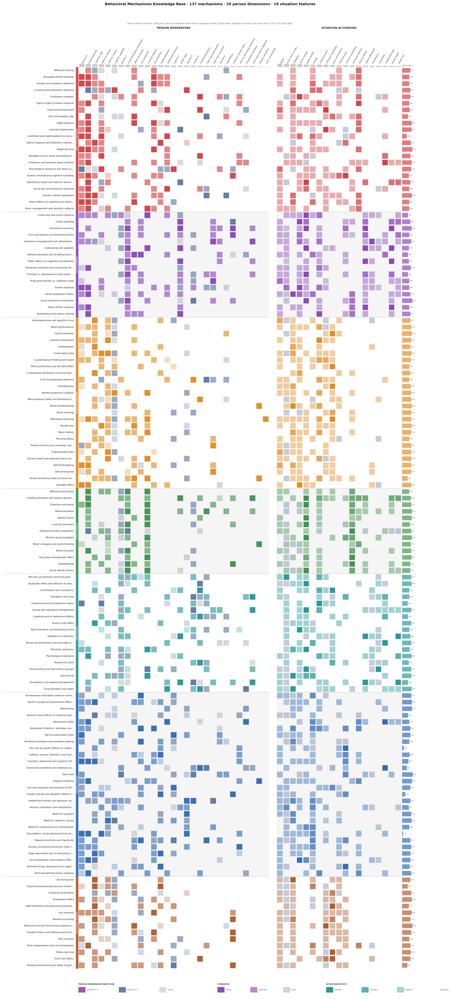
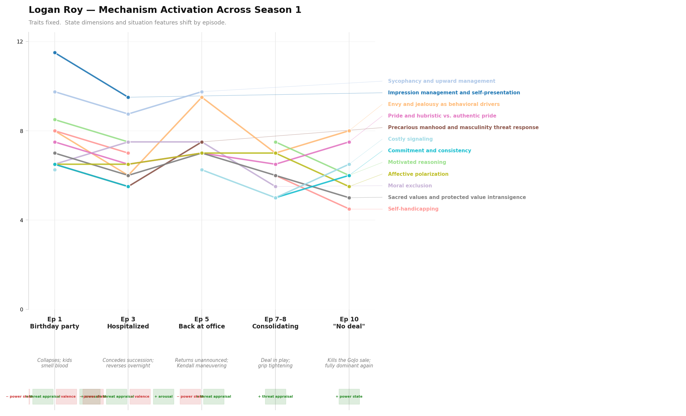

# drivermap

[](https://github.com/justinstimatze/drivermap/actions/workflows/ci.yml)
[](https://www.python.org/downloads/)
[](LICENSE)

A structured knowledge base of 137 behavioral mechanisms, built so an LLM agent can
query it mid-session rather than reconstruct psychological reasoning from scratch each time.

**[Interactive Explorer](https://justinstimatze.github.io/drivermap/)** — toggle dimensions, check situation features, see ranked mechanisms update live.



The core thesis is situationist: the same person in three different rooms activates
three different mechanism profiles. A department head at a team lunch (power holder,
group context) gets dominance and prestige mechanisms; the same person at a board
review (under authority) gets compliance and impression management; alone in the
office, neither fires. B = f(P, E) — behavior is a function of person *and* environment.

Each mechanism is operationalized: not just "loss aversion exists" but the specific
person dimensions that amplify it, the situation features that activate it, and the
observable outputs an agent can match against real behavior. This lets it function as
working memory about a person — query it mid-session, update it as new signals arrive,
generate dialog from it.

**137 mechanisms across 7 domains:**
- Threat and affective priming
- Status and dominance
- Posthoc rationalization
- In-group / out-group dynamics
- Social influence and compliance
- Individual variation
- Loss aversion and reference points

**What makes it usable rather than just informative:**
- A controlled vocabulary of 29 person dimensions (trait + state) and 19 situation
  features that stays consistent across all 137 mechanisms
- A scoring layer that turns `{profile} + [situation]` into ranked, weighted mechanism
  predictions
- Plain-language outputs for each mechanism: the observable behaviors and statements
  a person in that state actually produces
- A verbalization layer that maps `hidden mechanism + action → surface rationalization`
  — what the person would say out loud, not what's actually driving them

## Demo

Five scenarios end-to-end: profile + situation → ranked mechanisms → verbalized
rationalization. [See sample output →](assets/demo_output.txt)

```bash
python demo.py
```

Verbalization text varies per run (it's Claude-generated). Mechanism rankings are
deterministic. The fifth scenario is a detailed profile-driven analysis — study the
setup in `demo.py` and adapt the profile for your own cases.

`evolution.py` tracks mechanism scores across five moments with traits fixed and
state dimensions shifting. [Sample output →](assets/logan_evolution.png)



```bash
python evolution.py                                     # → assets/logan_evolution.png
```

## Setup

```bash
python -m venv .venv && source .venv/bin/activate
pip install -e ".[dev]"
python mcp_server.py
```

The DB (`db/mechanisms.sqlite`) is included in the repo — no build step needed.
The server registers as `"drivermap"` in `~/.claude/settings.json`. See `INTEGRATION.md`
for the full API reference and worked examples.

### Rebuilding the knowledge base

If you want to re-extract from source (adds new mechanisms, updates existing ones):

```bash
# Dependencies: Claude CLI on PATH (Max plan), Kagi API key, optionally
# a Kiwix server at localhost:8080 for Wikipedia (any Wikipedia text source works).
cp .env.example .env   # fill in KAGI_API_KEY
python fetch.py --skip-existing       # fetch Wikipedia + Kagi abstracts → corpus/
python extract.py --guided --skip-existing  # LLM extraction via claude --print → extracted/
python db_load.py --rebuild           # rebuild db/mechanisms.sqlite
python build_explorer.py              # regenerate docs/index.html
```

## Query CLI

```bash
python query.py --dim big_five_N:+ --dim attachment_anxious:+
python query.py --dim big_five_N:+ --feature social_visibility --feature stakes
python query.py --dim big_five_N:+ --scenario "received critical feedback in a team meeting"
python query.py --verbalize loss_aversion --action "refused to cut losses on a failing project"
python query.py --stats
```

**Note:** `--scenario` extracts situation features from free text via keyword matching (not
semantic search). Always combine it with at least one `--dim` — multiplicative scoring
requires person_score > 0, so situation-only queries return no results. For pure
situation exploration, use the interactive explorer instead.

Example output for `--dim big_five_N:+ --feature stakes --feature social_visibility`:
```
 1. self_handicapping         score=3.75  [posthoc_rationalization]
    +big_five_N  | stakes(activates)  social_visibility(activates)
 2. spotlight_effect          score=3.75  [posthoc_rationalization]
    +big_five_N  | social_visibility(activates)  stakes(activates)
 3. big_five_personality      score=3.00  [individual_variation]
    +big_five_N  | social_visibility(amplifies)  stakes(amplifies)
```

## Benchmarks

```bash
python benchmark.py --synthetic      # paradigm recall: R@3=100%, R@5=100% (random baseline ~2.3%)
python benchmark.py --social-chem    # rationalization coherence vs SC101 ROTs
python benchmark.py --atomic         # ATOMIC 2020 output chain alignment
python benchmark.py --all            # everything except LLM-cost modes
```

`--synthetic` measures retrieval quality: for each mechanism's canonical profile+situation,
does it rank in the top results? Random baseline is ~2.2% R@3 (3/137). It validates the
scoring and extraction pipeline, not the underlying psychological claims, which come from the
source literature (see [REFERENCES.md](REFERENCES.md)).

`--social-chem` and `--atomic` are exploratory — they compare outputs against external
datasets (Social Chemistry 101, ATOMIC 2020) as a rough alignment check, not formal
validation.

## Design notes

**Why not a vector store?** The 29 person dimensions and 19 situation features are themselves
the embedding space — purpose-built for behavioral psychology rather than borrowed from general
text. Scoring over this controlled vocabulary is transparent (you can see exactly which
dimensions fired and why), deterministic, and requires no embedding infrastructure. The main
tradeoff is that free-text `--scenario` queries rely on keyword extraction rather than semantic
similarity.

**Why not just prompt the LLM directly?** For a one-off question it's often fine. This is
useful when you need consistent vocabulary across a session (the LLM's terminology shifts;
this doesn't), working memory without context cost (a profile + top mechanisms fits in a few
hundred tokens rather than a long system prompt), structured inspectable output (ranked,
filterable, with per-dimension weights visible), and updatable state as new signals arrive
mid-session.

**Scoring** uses a multiplicative person × situation model (`person * (1 + situation * k)`,
where `k = 0.5`) aligned with the interactionist tradition (Lewin B=f(P,E), Mischel &
Shoda CAPS): person traits are necessary but not sufficient — situation enables what the
person is disposed toward. If person score ≤ 0, the mechanism is excluded entirely.
Weights (strong=1.5, moderate=1.0, weak=0.5) were tuned empirically against the synthetic
benchmark. They're not formally validated against population data. See
[REFERENCES.md](REFERENCES.md) for the theoretical lineage.

**Output registers:** Each mechanism has two output sets. `plain_language_outputs` are
casual-register phrases for dashboards and diagnostics ("wants approval", "follows the
crowd"). `narrative_outputs` are clinical-register mechanism descriptions for embedding
in LLM system prompts ("status-maintenance drive active — monitors for challenges to
authority"). Consumers building LLM integrations should prefer `narrative_outputs`.

**Negative dimension gap:** Profiles with `"-"` direction (e.g. `need_for_closure: -`)
produce weaker results because most mechanisms activate on trait presence, not absence.
Workaround: omit the dimension rather than marking it negative. Longer-term fix: adding
inverse mechanisms (tolerance of ambiguity, secure attachment, etc.).

**Mechanism selection:** Mechanisms were included if they have a distinct experimental
paradigm with replication, an identifiable input→process→output chain not reducible to
existing entries, and named coverage in the academic literature. Mechanisms that decompose
cleanly into combinations of existing ones (e.g. backfire effect, variable ratio
reinforcement) were excluded. The 7 domains are organized by use case rather than by
theoretical level — they mix processes, biases, and social dynamics intentionally.

**Intended use:** Profiles are local by default (`profiles.json`, gitignored). This is
designed for self-audit, research, and dialog/character work. The
`analyze_description_bias` tool operates on text the user provides, not on third-party
data collected without consent.

## Integration

See [INTEGRATION.md](INTEGRATION.md) for the full MCP tool reference, dimension and
situation feature vocabulary, and a worked example covering intake → prediction →
verbalization.

## License

MIT — see [LICENSE](LICENSE). The extracted knowledge base is derived from
Wikipedia (CC BY-SA 4.0) and is likewise available under CC BY-SA 4.0. See
[NOTICE](NOTICE) for full third-party acknowledgments.
